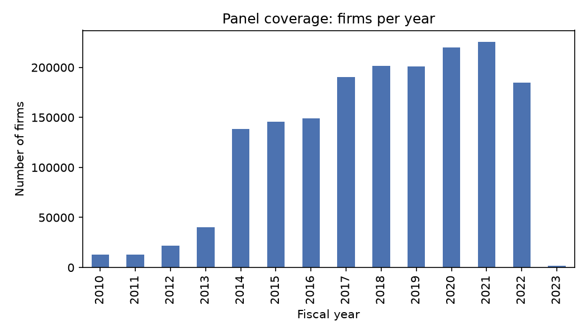
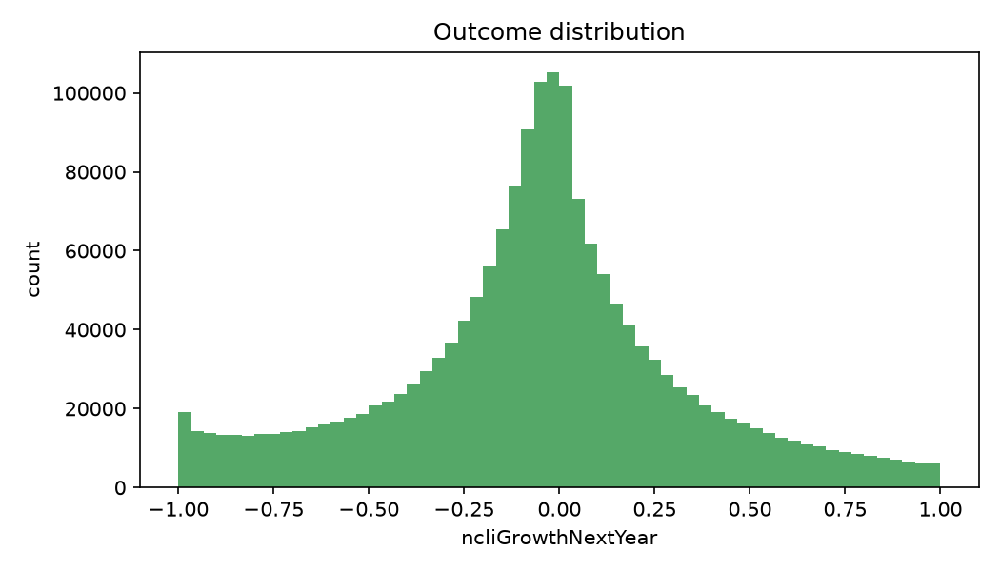
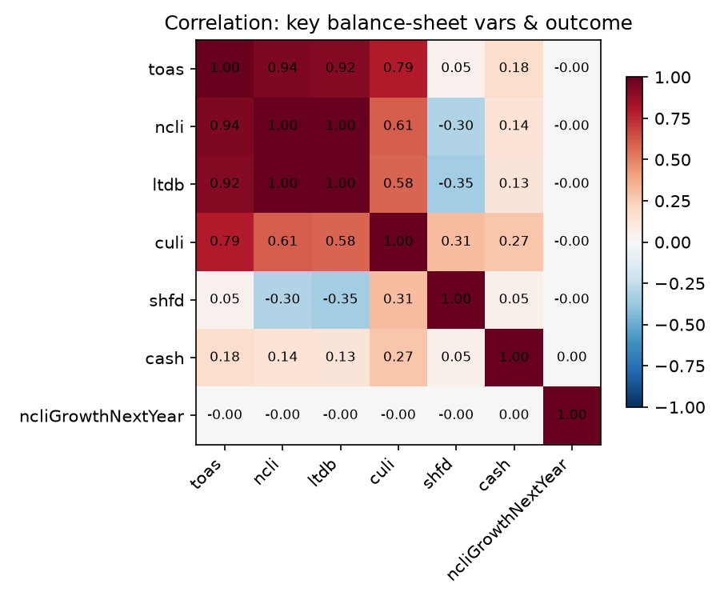

# Firm Data Report — A_FirmData.csv

_Auto-generated by `generate_data_report.py`. Do not edit by hand — rerun the script instead._

## 1. Overview

- **Source file:** `A_FirmData.csv`
- **Generated:** 2026-07-15 09:45
- **Rows (firm-years):** 1,745,766
- **Columns:** 31
- **Unique firms (idnr):** 285,321
- **Fiscal years covered:** 2010–2023
- **Duplicate (idnr, closdate_year) pairs:** 0 ✅ none
- **In-memory size:** 790.2 MB

Unit of observation: one row per firm per fiscal year. All monetary variables are in **thousands of EUR**. Sample already restricted to German (DE), EUR-reporting, unconsolidated, December fiscal-year-end firms; see `A_FirmData_description.txt` for the full construction.

## 2. Schema & missingness

| Variable           | Description                                                | Dtype          |   Missing (n) |   Missing (%) |   Unique |
|:-------------------|:-----------------------------------------------------------|:---------------|--------------:|--------------:|---------:|
| wkca               | Working capital                                            | float64        |        680906 |         39    |   654477 |
| empl               | Number of employees                                        | float64        |        675872 |         38.71 |     3267 |
| cred               | Creditors / accounts payable                               | float64        |        665601 |         38.13 |   209314 |
| loan               | Loans (short-term, within current liabilities)             | float64        |        659154 |         37.76 |   129236 |
| ocli               | Other current liabilities                                  | float64        |        512538 |         29.36 |   867751 |
| dateinc            | Date of incorporation                                      | datetime64[us] |        129154 |          7.4  |    22065 |
| cash               | Cash and cash equivalents                                  | float64        |         63218 |          3.62 |  1029271 |
| ofas               | Other fixed assets                                         | float64        |         60727 |          3.48 |   250812 |
| tfas               | Tangible fixed assets                                      | float64        |         60643 |          3.47 |  1059919 |
| ifas               | Intangible fixed assets                                    | float64        |         60594 |          3.47 |   255358 |
| capi               | Capital (subscribed / paid-in)                             | float64        |         39314 |          2.25 |   195663 |
| osfd               | Other shareholders' funds                                  | float64        |         39314 |          2.25 |  1180705 |
| stok               | Stocks / inventories                                       | float64        |         29157 |          1.67 |   822456 |
| debt               | Debtors / accounts receivable                              | float64        |         29124 |          1.67 |   203495 |
| ocas               | Other current assets                                       | float64        |         12296 |          0.7  |  1376694 |
| prov               | Provisions                                                 | float64        |           114 |          0.01 |   801276 |
| fias               | Fixed assets (total)                                       | float64        |           160 |          0.01 |  1170245 |
| naics_core_code    | NAICS industry code (primary activity)                     | Int64          |             0 |          0    |      310 |
| ncliGrowthNextYear | One-year-ahead growth in non-current liabilities (outcome) | float64        |             0 |          0    |  1725774 |
| type               | Legal form / company type (raw from BvD)                   | string         |             0 |          0    |       28 |
| name               | Company name                                               | string         |             0 |          0    |   282111 |
| closdate_year      | Fiscal year                                                | Int64          |             0 |          0    |       14 |
| idnr               | BvD unique firm identifier                                 | string         |             0 |          0    |   285321 |
| cuas               | Current assets (total)                                     | float64        |            37 |          0    |  1475070 |
| ncli               | Non-current liabilities (total)                            | float64        |             0 |          0    |  1305485 |
| toas               | Total assets                                               | float64        |             0 |          0    |  1563628 |
| shfd               | Shareholders' funds (total equity)                         | float64        |             0 |          0    |  1299038 |
| ltdb               | Long-term debt (within non-current liabilities)            | float64        |             0 |          0    |   993066 |
| oncl               | Other non-current liabilities                              | float64        |             0 |          0    |   806081 |
| culi               | Current liabilities (total)                                | float64        |            60 |          0    |   951387 |
| tshf               | Total shareholders' funds and liabilities                  | float64        |             0 |          0    |  1563620 |

## 3. Panel structure

- **Firm-years per firm:** mean 6.12, median 7, max 9

**Firms observed per fiscal year:**

|   closdate_year |   n_firms |
|----------------:|----------:|
|            2010 |     13132 |
|            2011 |     12950 |
|            2012 |     21697 |
|            2013 |     39952 |
|            2014 |    138425 |
|            2015 |    145431 |
|            2016 |    149223 |
|            2017 |    190256 |
|            2018 |    201611 |
|            2019 |    201125 |
|            2020 |    219774 |
|            2021 |    225669 |
|            2022 |    184836 |
|            2023 |      1685 |

## 4. Firm characteristics

**Legal form (`type`):**

| type                                                                    |   n_firm_years |
|:------------------------------------------------------------------------|---------------:|
| Limited liability company - GmbH                                        |        1340466 |
| Limited liability company & partnership - GmbH & Co. KG                 |         349406 |
| Registered cooperative - eG                                             |          22952 |
| Public limited company - AG                                             |          22800 |
| Entrepreneurial company (limited liability) - UG                        |           2767 |
| Entrepreneurial company (limited liability) & partnership - UG & Co. KG |           2377 |
| Limited partnership - KG                                                |            949 |
| European company - SE                                                   |            927 |
| General partnership - OHG                                               |            655 |
| Public limited partnership - AG & Co. KG                                |            566 |
| Institution under public law                                            |            406 |
| Public corporation                                                      |            309 |
| Foreign company                                                         |            275 |
| Limited liability company & partnership by shares - GmbH & Co. KGaA     |            258 |
| Public company                                                          |            184 |
| Registered individual business - e.U.                                   |             75 |
| Foundation & partnership                                                |             67 |
| Limited partnership by shares - KGaA                                    |             62 |
| Registered cooperative & partnership - eG & Co. KG                      |             44 |
| Civil right partnership - GbR                                           |             39 |
| Foundation                                                              |             37 |
| Association - Verein                                                    |             36 |
| Public limited partnership by shares - AG & Co. KGaA                    |             30 |
| Limited liability partnership                                           |             28 |
| Association & partnership - Verein & Co. KG                             |             24 |
| European economic interest group - EWIV                                 |             15 |
| Limited partnership & partnership - KG & Co. KG                         |              7 |
| European cooperative company - SCE                                      |              5 |

**Top 15 industries (`naics_core_code`):**

|   naics_core_code |   n_firm_years |
|------------------:|---------------:|
|              2382 |          75896 |
|              5311 |          62344 |
|              5511 |          60723 |
|              5413 |          54818 |
|              5415 |          48829 |
|              5614 |          47426 |
|              2361 |          45763 |
|              4231 |          40326 |
|              5312 |          38241 |
|              2211 |          37815 |
|              5313 |          36736 |
|              4238 |          35375 |
|              6241 |          33150 |
|              2381 |          32364 |
|              4889 |          29721 |

**Employees (`empl`):** available for 1,069,894 / 1,745,766 firm-years (61.3%). Median 24, mean 63.9, max 90335.

## 5. Balance-sheet variables — descriptive statistics

All figures in thousands of EUR.

| variable   |       count |        mean |         std |               min |                1% |   25% |    50% |              75% |         99% |         max |
|:-----------|------------:|------------:|------------:|------------------:|------------------:|------:|-------:|-----------------:|------------:|------------:|
| fias       | 1.74561e+06 | 1.05228e+09 | 1.29912e+11 | -431068           |       0           | 104.2 |  539.9 | 250760           | 1.0411e+08  | 4.80044e+13 |
| ifas       | 1.68517e+06 | 2.85773e+07 | 8.7501e+09  |      -1.6434e+06  |       0           |   0   |    0.6 |     25.1         | 1.43847e+06 | 6.67793e+12 |
| tfas       | 1.68512e+06 | 2.13112e+08 | 2.37366e+10 |      -1.61974e+08 |       0           |  72.9 |  378.4 |  73286.5         | 6.59483e+07 | 1.18748e+13 |
| ofas       | 1.68504e+06 | 1.25976e+09 | 2.64767e+11 | -207023           |       0           |   0   |    0   |     50           | 3.44414e+07 | 2.00925e+14 |
| cuas       | 1.74573e+06 | 2.08832e+09 | 8.83739e+11 |      -2.34399e+06 |      41.6         | 562.8 | 1455.2 |      1.08644e+06 | 5.83112e+07 | 6.66667e+14 |
| stok       | 1.71661e+06 | 5.81293e+07 | 8.70374e+09 |      -2.55606e+08 |       0           |   0   |  118.6 |   1307.2         | 1.44887e+07 | 8.51802e+12 |
| debt       | 1.71664e+06 | 6.2477e+07  | 7.81803e+09 |       0           |       0           |   0   |    0   |      0           | 9.7096e+06  | 3.382e+12   |
| ocas       | 1.73347e+06 | 1.98354e+09 | 8.86505e+11 |      -6.99313e+06 |      12.1         | 379.7 |  991.7 | 637221           | 3.78244e+07 | 6.66667e+14 |
| cash       | 1.68255e+06 | 7.04604e+07 | 1.81238e+10 |      -1.21728e+08 |       0.2         |  89.9 |  394.3 |  59304.8         | 1.22945e+07 | 1.92394e+13 |
| toas       | 1.74577e+06 | 3.5401e+09  | 1.10503e+12 |      -7.75541e+06 |     125.6         | 917.9 | 2388.7 |      3.8012e+06  | 1.58102e+08 | 7.86627e+14 |
| shfd       | 1.74577e+06 | 6.73667e+08 | 3.09858e+11 |      -1.27236e+14 |      -1.39496e+06 | 179.8 |  746.2 | 273316           | 7.27778e+07 | 2.59693e+14 |
| capi       | 1.70645e+06 | 7.34195e+07 | 1.97108e+10 |      -5.40835e+08 |       0           |  25   |   51.1 |  25000           | 1.66821e+07 | 2.40574e+13 |
| osfd       | 1.70645e+06 | 6.15405e+08 | 3.12149e+11 |      -1.27262e+14 |      -2.36098e+06 |  24.2 |  450.2 |   3565.8         | 5.94318e+07 | 2.59667e+14 |
| ncli       | 1.74577e+06 | 2.11688e+09 | 1.03442e+12 |      -1.34108e+07 |       7.5         | 229.4 |  814.1 | 477307           | 5.93115e+07 | 7.94198e+14 |
| ltdb       | 1.74577e+06 | 1.63775e+09 | 9.303e+11   |      -1.36682e+07 |       0           |   7.4 |  340   |   3079.3         | 4.54998e+07 | 7.17387e+14 |
| oncl       | 1.74577e+06 | 4.79136e+08 | 1.24891e+11 |      -3.57311e+08 |       1           |  45.1 |  162   |  32350           | 1.29104e+07 | 8.43765e+13 |
| prov       | 1.74565e+06 | 4.77558e+08 | 1.24889e+11 |      -3.57311e+08 |       1           |  44.2 |  159.9 |  31000           | 1.26661e+07 | 8.43765e+13 |
| culi       | 1.74571e+06 | 7.49573e+08 | 1.53378e+11 |      -2.35978e+07 |       0           |   0   |  244.3 |   3105.1         | 3.23554e+07 | 1.0909e+14  |
| loan       | 1.08661e+06 | 4.0794e+07  | 1.23562e+10 |       0           |       0           |   0   |    0   |      0           | 6.22627e+06 | 1.09265e+13 |
| cred       | 1.08016e+06 | 8.1498e+07  | 8.17113e+09 |       0           |       0           |   0   |    0   |      0           | 8.69465e+06 | 2.89455e+12 |
| ocli       | 1.23323e+06 | 9.52963e+08 | 1.7997e+11  |      -2.35978e+07 |       0.3         | 128.2 |  566.1 | 255210           | 3.35596e+07 | 1.0909e+14  |
| tshf       | 1.74577e+06 | 3.5401e+09  | 1.10503e+12 |      -7.75541e+06 |     125.6         | 917.9 | 2388.7 |      3.80118e+06 | 1.58102e+08 | 7.86627e+14 |
| wkca       | 1.06486e+06 | 1.10947e+08 | 1.52929e+10 |      -1.11e+12    | -898554           |   0   |  165.8 |   2537           | 2.57199e+07 | 1.00768e+13 |

**⚠️ Negative values found in items normally expected ≥ 0:**

  - `fias`: 15 negative values
  - `cuas`: 24 negative values
  - `toas`: 183 negative values
  - `tshf`: 191 negative values
  - `culi`: 58 negative values
  - `ncli`: 25 negative values

## 6. Outcome variable: `ncliGrowthNextYear`

- **Non-missing observations:** 1,745,766 / 1,745,766 (100.0%)
- **Mean:** -0.0570   **Std:** 0.3899   **Median:** -0.0418
- **1st/99th pct:** [-0.970, 0.908]  (range is bounded in (-1, 1) by construction — see description.txt)

## 7. Correlations (selected variables)

